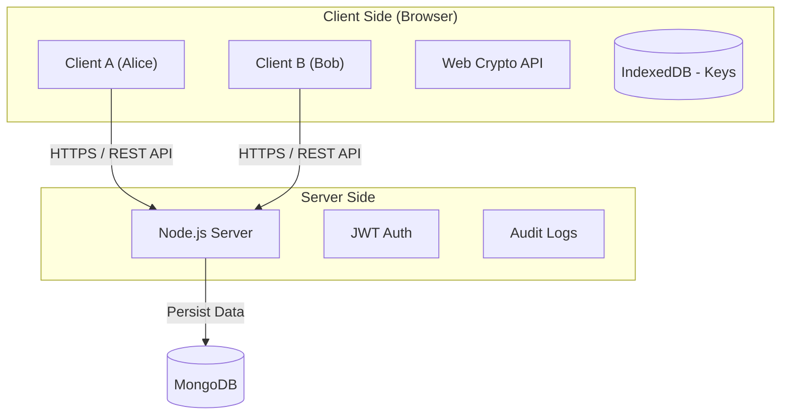
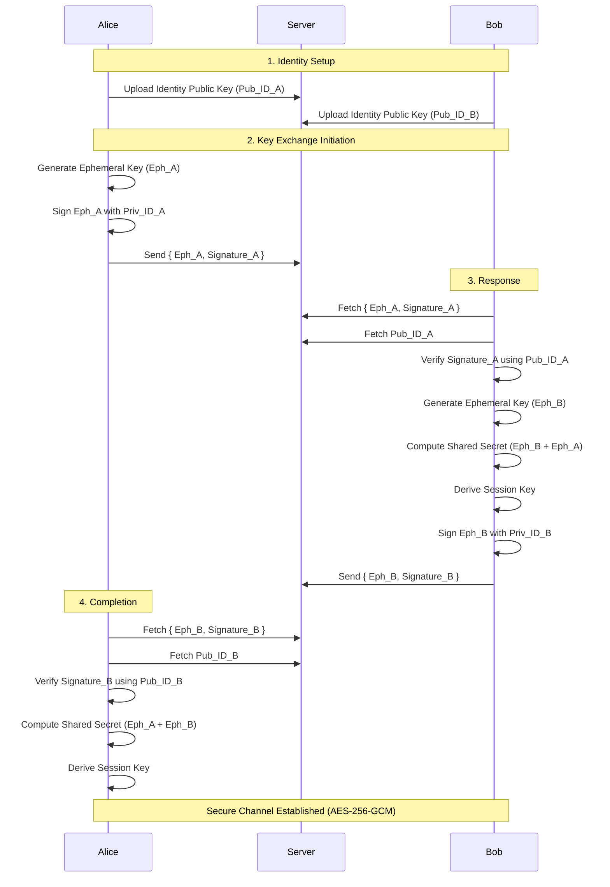
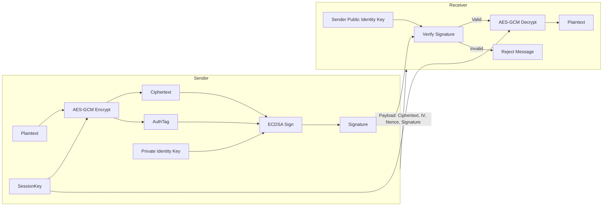

# Secure End-to-End Encrypted Messaging System - Project Report

## 1. Introduction
This project implements a secure, end-to-end encrypted (E2EE) messaging and file sharing system. It addresses the critical need for private communication by ensuring that the service provider (server) has zero knowledge of the message content. The system defends against common attacks such as Man-in-the-Middle (MITM), Replay, and Tampering.

### Problem Statement
Traditional messaging systems often store messages in plaintext or use encryption keys managed by the server, leaving user data vulnerable to server-side breaches, insider threats, and mass surveillance. This project aims to solve this by implementing client-side encryption where only the communicating users hold the decryption keys.

---

## 2. System Architecture

The system follows a client-server architecture where the server acts as a blind relay and storage for encrypted data.

### High-Level Architecture



**Technology Stack:**
*   **Frontend:** React, Vite, TailwindCSS
*   **Backend:** Node.js, Express.js
*   **Database:** MongoDB (Mongoose)
*   **Cryptography:** Web Crypto API (Client), Node.js Crypto (Server)

---

## 3. Cryptographic Design

The security of the system relies on a hybrid encryption scheme combining Elliptic Curve Cryptography (ECC) and AES.

### Algorithms
*   **Key Exchange:** ECDH (Elliptic Curve Diffie-Hellman) using NIST P-256 curve.
*   **Digital Signatures:** ECDSA (Elliptic Curve Digital Signature Algorithm) with P-256 and SHA-256.
*   **Symmetric Encryption:** AES-256-GCM (Galois/Counter Mode) for authenticated encryption of messages.
*   **Key Derivation:** HKDF (HMAC-based Key Derivation Function) with SHA-256 to derive session keys from shared secrets.
*   **Hashing:** SHA-256 for integrity checks and signatures.

### Key Management
1.  **Identity Keys (Long-term):**
    *   Generated once per user.
    *   **Private Identity Key:** Stored securely in the browser's IndexedDB (non-exportable where possible).
    *   **Public Identity Key:** Uploaded to the server for other users to verify identity.
2.  **Session Keys (Ephemeral):**
    *   Derived via ECDH for each conversation pair.
    *   Rotated per session (implementation supports rotation).
    *   Stored in IndexedDB.

---

## 4. Protocols

### 4.1 Signed ECDH Key Exchange
To prevent MITM attacks, all ephemeral keys used for ECDH are signed with the user's long-term Identity Key.



### 4.2 Encryption & Decryption Workflow



---

## 5. Database Schema Design

### User
*   `username`: String (Unique)
*   `passwordHash`: String (Bcrypt)

### PublicKey
*   `userId`: ObjectId (Ref: User)
*   `publicKeyJwk`: String (JSON Web Key format)

### ConversationState (Replay Protection)
*   `senderId`: ObjectId
*   `receiverId`: ObjectId
*   `lastSequenceNumber`: Number (Strictly increasing)

### ReplayLog
*   `nonce`: String (Unique index)
*   `timestamp`: Date (TTL index for expiry)

### AuditLog
*   `eventType`: String (LOGIN, KEY_EXCHANGE, REPLAY_DETECTED, etc.)
*   `userId`: ObjectId
*   `status`: String (SUCCESS, FAILURE)
*   `severity`: String (INFO, WARNING, CRITICAL)
*   `details`: Object (JSON)

---

## 6. Threat Model (STRIDE)

A detailed STRIDE analysis was performed (see `Stride.md`).

| Threat | Mitigation |
| :--- | :--- |
| **Spoofing** | Signed ECDH Key Exchange, JWT Authentication. |
| **Tampering** | AES-GCM (Authenticated Encryption), Digital Signatures. |
| **Repudiation** | Digital Signatures on all messages, Audit Logging. |
| **Information Disclosure** | End-to-End Encryption (Zero-Knowledge Server). |
| **Denial of Service** | Replay Protection (Nonces/Timestamps), Rate Limiting. |
| **Elevation of Privilege** | Strict Ownership Checks, Authorization Middleware. |

---

## 7. Attack Demonstrations

### 7.1 Man-in-the-Middle (MITM) Attack
*   **Script**: `server/scripts/mitm_attack.js`
*   **Scenario 1 (Unsecured)**: Attacker intercepts keys and successfully decrypts messages.
*   **Scenario 2 (Secured)**: Attacker attempts to inject their key. The victim verifies the signature against the trusted Identity Key, detects the mismatch, and **aborts the connection**.
*   **Result**: The system is proven secure against active MITM attacks.

### 7.2 Replay Attack
*   **Script**: `server/scripts/replay_attack.js`
*   **Scenario**: Attacker captures a valid encrypted message and attempts to resend it later.
*   **Defense**:
    1.  **Nonce Check**: Server rejects reused nonces.
    2.  **Sequence Number**: Server rejects messages with `seq <= lastSeq`.
    3.  **Timestamp**: Server rejects messages older than 5 minutes.
*   **Result**: The server responds with `403 Forbidden` and logs a `REPLAY_DETECTED` security event.

---

## 8. Logging & Auditing

The system maintains a centralized `AuditLog` in MongoDB.

**Logged Events:**
*   `LOGIN_ATTEMPT` / `REGISTER_ATTEMPT`
*   `KEY_EXCHANGE_INITIATE`
*   `MESSAGE_SEND`
*   `REPLAY_DETECTED` (Critical)
*   `SIGNATURE_INVALID` (Critical)
*   `DECRYPTION_FAILURE` (Reported by Client)

**Sample Log Entry:**
```json
{
  "timestamp": "2025-11-30T21:45:00.000Z",
  "eventType": "REPLAY_DETECTED",
  "status": "FAILURE",
  "severity": "CRITICAL",
  "userId": "64f...",
  "details": { "reason": "Nonce reused", "nonce": "a1b2..." }
}
```

---

## 9. Deployment

### Prerequisites
*   Node.js (v16+)
*   MongoDB (Local or Atlas)

### Steps
1.  **Clone Repository**
2.  **Install Dependencies**:
    ```bash
    cd server && npm install
    cd ../client && npm install
    ```
3.  **Configure Environment**:
    *   Create `server/.env` with `MONGODB_URI`, `JWT_SECRET`, `PORT`.
4.  **Start Server**:
    ```bash
    cd server && npm start
    ```
5.  **Start Client**:
    ```bash
    cd client && npm run dev
    ```

---

## 10. Conclusion

This project successfully demonstrates a secure, privacy-focused messaging system. By implementing robust End-to-End Encryption, Signed ECDH key exchange, and comprehensive replay protection, the system ensures that user data remains confidential and integral, even in the face of network interception or server compromise. The inclusion of a detailed audit logging system further enhances security by providing visibility into potential attacks.
